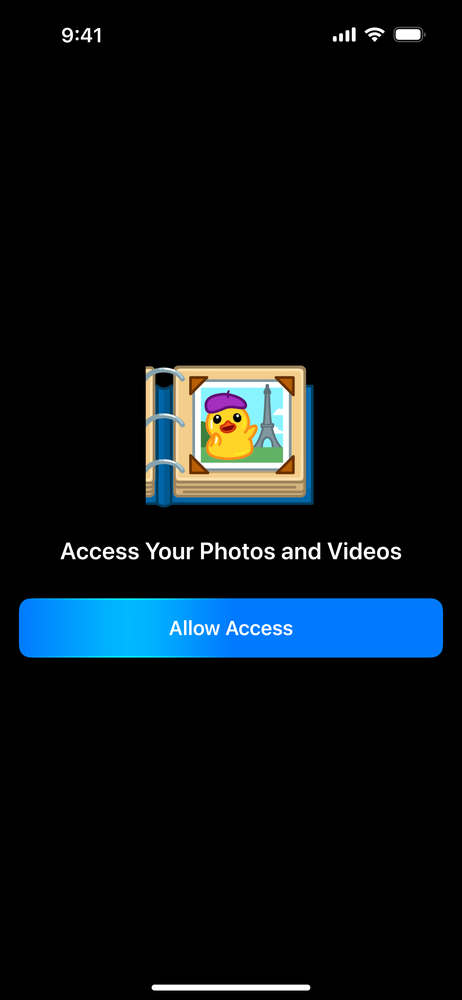

# Telegram iOS Contest app


## Table of Contents

- [Getting Started](#getting-started)
    - [Prerequisites](#prerequisites)
    - [Installation](#installation)
- [References](#references)
- [About](#about)
- [Sources](#sources)
    - [Screens](#screens)

## Getting Started

### Prerequisites
- Xcode 13+
- [Xcode Text Editing preferences](docs/XcodePreferences.md)

### Installation

#### Repository
```bash
git clone https://github.com/elyahk/Telegram_iOS.git
cd Telegram\ iOS
git config --local include.path ../.gitconfig
```

#### For only Macbook M1+ chips
1. Select an app in the Finder.
2. From the File menu in the menu bar, choose Get Info.
3. See the information labeled Kind:
    * Application (Intel) means the app supports only Intel processors and needs Rosetta to work on a Mac with Apple silicon.
    * Application (Universal) means the app supports both Apple silicon and Intel processors, and uses Apple silicon by default. Universal apps don't need Rosetta.
4. Check “Open using Rosetta.” under the `General` section. [More Info](https://support.apple.com/en-us/HT211861)

#### Swift Packages
Open `.xcworkspace` with Xcode and select `File -> Swift Packages -> Resolve Package Versions`

[Back to top](#table-of-contents)

## References

- [Swift API Design Guidelines](https://swift.org/documentation/api-design-guidelines)
- [Semantic Versioning Rules](https://semver.org/)

[Back to top](#table-of-contents)

## About
**This is telegram iOS contest**

Telegram announces the First Round of the iOS Contest 2022

Prize fund for Round 1: $50,000 
Deadline: 23:59 on October 31th (Dubai time)
Who can participate: Everyone
Results: November 10th, 2022

The task is to create a standalone media editing app in Swift without using third-party UI frameworks. Submissions must include a variety of tools to add drawings and edit text based on the provided mockups.

Details: 
For a complete description of the required features, see this document.

Contest Requirements:
• No third-party UI frameworks are allowed.
• Your app should be compatible with iOS 13 and above.
• The contest features and interfaces must be built from scratch. Using third-party implementations of media editors with similar features is strictly prohibited. Such entries will be disqualified. 

Evaluation Criteria:
During the evaluation stage, Telegram judges will test the submissions on a broad range of iOS devices from the iPhone 6s to 14 Pro. The key factors in determining the best apps are:

- The general aesthetics of the app.
- Adherence to the provided mockups and design elements. 
- Attention to the tiniest details in the user’s experience.

The smoothness of animations and the overall stability of the app will play a major role. Last but not least is the absence of significant flaws (including crashes, performance issues, visual glitches, noticeable element blinking, layout imperfections and more). 

To be evaluated, all submitted apps must include the minumum required features. Winners may be offered a chance to join the Telegram team in Dubai.

Submissions:
Contestants will be able to submit their entries to @ContestBot at the end of this round. We will further clarify the submission instructions closer to the deadline.

## About

### Screens

Solarized dark             |  Solarized Ocean          |  Solarized Ocean          
:-------------------------:|:-------------------------:|:-------------------------:
  |   | 
:-------------------------:|:-------------------------:|:-------------------------:
  |   | 
