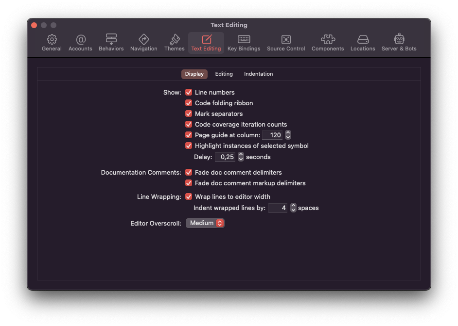
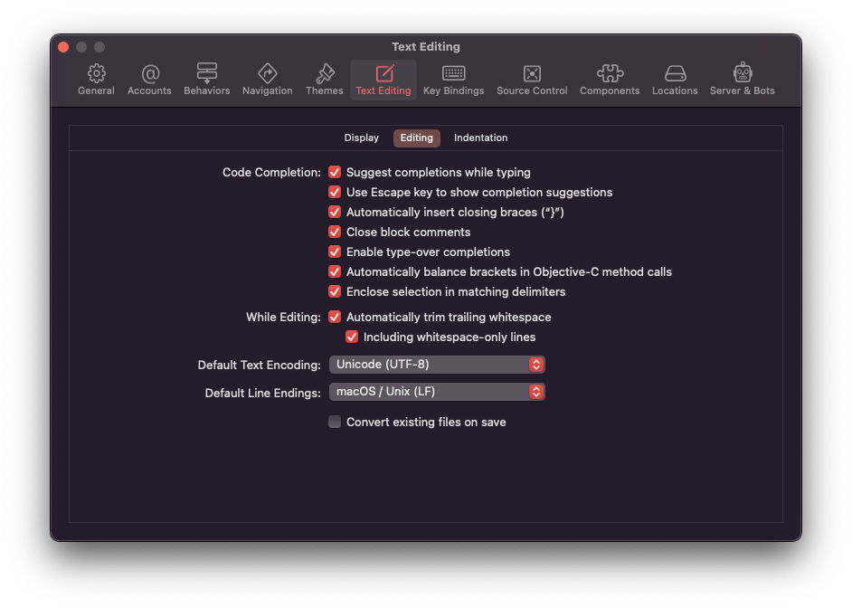
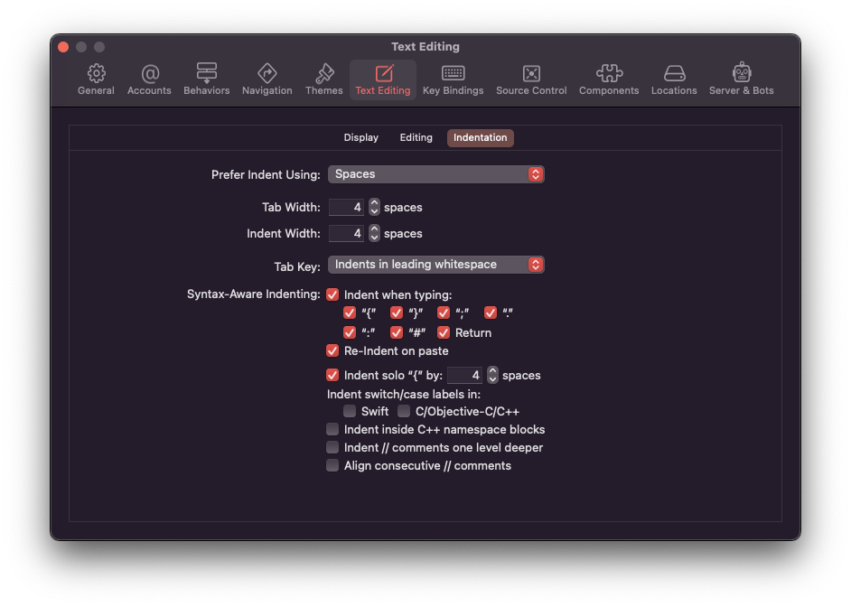

# Set up Xcode Text Editing Preferences

1. Open Xcode and go to the `Preferences` (you can use `⌘ ,` shortcut)
2. Open `Text Editing` section
3. Select `Display` settings and make sure that all points looks like 
4. Select `Editing` settings and make sure that all points looks like 
5. Select `Indentation` settings and make sure that all points looks like 

 [Configuring SSH Key](ConfiguringSSHKey.md) 
 [Table of Contents](../README.md) 
